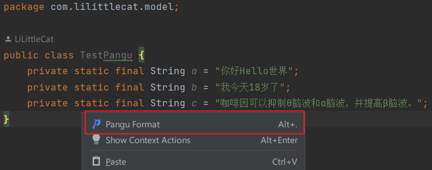
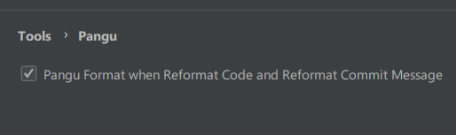
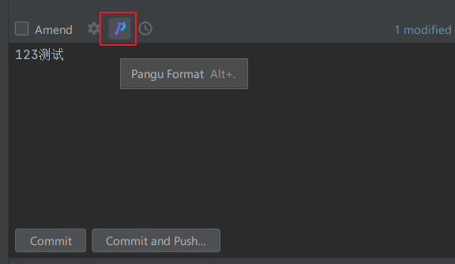

# Pangu


[](https://plugins.jetbrains.com/plugin/19665-pangu)
[](https://plugins.jetbrains.com/plugin/19665-pangu)

[中文说明](README_CN.md)

<!-- Plugin description -->

Paranoid text spacing for good readability, `Pangu  (PánGǔ)` is an IntelliJ Platform-Based IDEs plugin that automatically inserts whitespace between CJK (Chinese, Japanese, Korean), half-width English, digit, and symbol characters.

You can use this plugin to spacing files including markdown, plain text, Java code, HTML, XML, and more.

Here are some examples:

```diff
- 你好Hello世界
+ 你好 Hello 世界

- 我今天18岁了
+ 我今天 18 岁了

- 咖啡因可以抑制θ脑波和α脑波，并提高β脑波。
+ 咖啡因可以抑制 θ 脑波和 α 脑波，并提高 β 脑波。
```

<!-- Plugin description end -->

## Installation

- Using IDE built-in plugin system:

  <kbd>Settings/Preferences</kbd> > <kbd>Plugins</kbd> > <kbd>Marketplace</kbd> > <kbd>Search for "Pangu"</kbd> >
  <kbd>Install Plugin</kbd>

- Manually:

  Download the [latest release](https://github.com/LiLittleCat/intellij-pangu/releases/latest) and install it manually using
  <kbd>Settings/Preferences</kbd> > <kbd>Plugins</kbd> > <kbd>⚙️</kbd> > <kbd>Install plugin from disk...</kbd>

## Usage

You can use this plugin to spacing content in editor and commit message.

### In Editor
When you select some text in editor, the plugin will only space the selected text.
Otherwise, it will space the whole file.

There are three ways to use:
- See editor popup menu > <kbd>Pangu Format</kbd>

  

- Use <kbd>Alt + .</kbd> / <kbd>⌥ + .</kbd>

- Use Reformat Code Action (<kbd>Ctrl + Alt + L</kbd> / <kbd>⌘ + ⌥ + L</kbd>  by default)

  Pangu Format Action will perform after internal Reformat Code Action.

  You can disable this feature in <kbd>Settings/Preferences</kbd> > <kbd>Tools</kbd> > <kbd>Pangu</kbd>

  


### In Commit message

There are also three ways to use this plugin in commit message:

- Click the Pangu Format icon besides the commit message text area.

  

- Use <kbd>Alt + .</kbd> / <kbd>⌥ + .</kbd>

- Use Reformat Commit Message Action (<kbd>Ctrl + Alt + L</kbd> / <kbd>⌘ + ⌥ + L</kbd>  by default)

  Pangu Format Action will perform after internal Reformat Commit Message action.


## Thanks

- Thanks [XiaoYao][XiaoYao's link] for helping design the plugin icon.
- Thanks [vinta][vinta] for his great job [pangu.js][pangu.js].
- [IntelliJ Platform Plugin Template][template].
---

[XiaoYao's link]: https://space.bilibili.com/15765234
[template]: https://github.com/JetBrains/intellij-platform-plugin-template
[vinta]: https://github.com/vinta
[pangu.js]: https://github.com/vinta/pangu.js