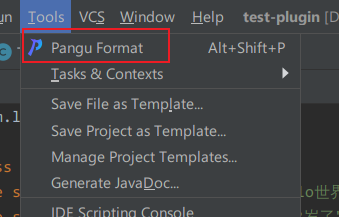

# Pangu


[](https://plugins.jetbrains.com/plugin/19665-pangu)
[](https://plugins.jetbrains.com/plugin/19665-pangu)

<!-- Plugin description -->

不同类型的文字中间增加空格可以提高可读性，`Pangu (PánGǔ)` 是一个可以自动在 CJK（中文、日文、韩文）、英文、数字和符号之间插入空格的插件，支持所有基于 IntelliJ 平台的 IDE。

你可以使用这个插件来对当前编辑的文件进行空格插入，支持各种常见的文件格式，如 markdown、Java、HTML、XML 等。

例子：

```diff
- 你好Hello世界
+ 你好 Hello 世界

- 我今天18岁了
+ 我今天 18 岁了

- 咖啡因可以抑制θ脑波和α脑波，并提高β脑波。
+ 咖啡因可以抑制 θ 脑波和 α 脑波，并提高 β 脑波。
```

<!-- Plugin description end -->

## 安装

- 使用 IDE 内部插件系统：

  <kbd>Settings/Preferences</kbd> > <kbd>Plugins</kbd> > <kbd>Marketplace</kbd> > <kbd> 搜索 "Pangu"</kbd> >
  <kbd>Install Plugin</kbd>

- 手动安装：

  下载 [最新版本](https://github.com/LiLittleCat/intellij-pangu/releases/latest) 找到
  <kbd>Settings/Preferences</kbd> > <kbd>Plugins</kbd> > <kbd>⚙️</kbd> > <kbd>Install plugin from disk...</kbd>
  手动安装。

## 使用

当你在文件中选中部分内容时，该插件只会在选中的部分进行空格插入。 没有选中时，该插件会在当前文件的所有文本进行空格插入。

有三种使用方式：

- 在编辑时右键弹出菜单中使用 <kbd>Pangu Format</kbd>。

  

- 在 <kbd>Tools</kbd> 中使用 <kbd>Pangu Format</kbd>。

  

- Use <kbd>⌥ + .</kbd> / <kbd>Alt + .</kbd> 。

## 致谢

- 感谢 [XiaoYao][XiaoYao's link] 帮忙设计插件图标。
- 感谢 [vinta][vinta] 的盘古之白项目 [pangu.js][pangu.js].
- [IntelliJ Platform Plugin Template][template].

---

[XiaoYao's link]: https://space.bilibili.com/15765234

[template]: https://github.com/JetBrains/intellij-platform-plugin-template

[vinta]: https://github.com/vinta

[pangu.js]: https://github.com/vinta/pangu.js